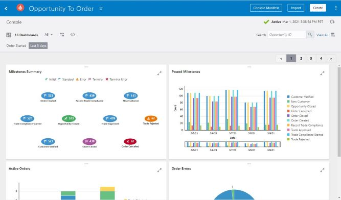

# Learning Objective 7: Custom Console Dashboards

## Introduction
While the Console page is display inforamtion about performance. Preconfigured Dashboards show nominal inforamtion, however, you can create a custom Dashboard to help identify bottlenecks or shortages in the process and track key metrics immediately and in real time.  
  

Estimated Lab Time: 15 minutes

More info on Insight Dashboards can be found [here](https://docs.oracle.com/en/cloud/paas/integration-cloud/user-int-insight-oci/work-console-and-dashboards-business-process.html).

## Learning Objectives
In this lab, you will learn how to create the following:
- Custom Dashboard
- Console Views

Consoles are created and associated within Insight automatically when a model, with defined business processes, has been activated. Standard Dashboards provide 5 summaries to view. However, you can create custom dashboards within Insight.

Custom dashboards use visualization charts, such as pie charts or bar charts, to represent indicators (dimensions and measures) for Insight models that have indicators defined. Creating custom dashboards track metrics, ratios, and trends that are important to the business. If a business process has indicators (dimensions and measures), custom dashboards can capture and visualize data related to the indicators.

Each custom dashboard is represented by a title and an icon. Custom dashboards can be filtered by a number of different criteria, including when a business transaction started or ended, how long the business transaction took to complete, and which milestones have most recently been passed. There is no limit to the number of custom dashboards that you can create.

TThere are 6 Chart Types:
*  A pie chart is a circular chart where each sector represents the quantity of a dimension you select. The size of each sector is determined by the value of a measure you select, aggregated using a function you select (such as average, sum, count, or standard deviation).
* A bar chart is a two-dimensional chart, where the X-axis values are computed based on the values of a dimension you select. Each bar on the graph is optionally grouped by the value of a second dimension. The Y-axis values are computed based on values of a measure you select, aggregated using a function you select (such as average, sum, count, or standard deviation).
A bar chart is the only chart type that lets you group by two different dimensions. You can swap the dimensions used for the X-axis and its grouping to change how the bars are displayed in the chart.
*  A bubble chart is a three-dimensional chart, where each bubble groups values of a dimension you choose. The size of each bubble is determined based on values of a measure you select, aggregated using a function you select (such as average, sum, count, or standard deviation). A bubble’s location on the X- and Y- axes is determined based on values of measures you select, aggregated using a function you select (such as average, sum, count, and standard deviation).
*  An area chart is a two-dimensional chart that is a line chart, where the area between the axes and line is shaded to represent the range of measure values for each dimension. The X-axis values are computed based on the values of a dimension you select. The Y-axis values are computed based on values of a measure you select, aggregated using a function you select (such as average, sum, count, or standard deviation).
*  A line chart is a two-dimensional chart that is represented by a series of data points connected with a straight line. Line charts are most often used to visualize data that changes over time. The X-axis values are computed based on the values of a dimension you select. The Y-axis values are computed based on values of a measure you select, aggregated using a function you select (such as average, sum, count, or standard deviation).
*    A scatter chartshows a single point for each point of data in a series without connecting them, showing patterns across hundreds of instances. The X-axis represents one measure, and the Y-axis represents another measure you select. Each point in the scatter chart is a combination of color and shape that represents a unique value of a dimension you select.